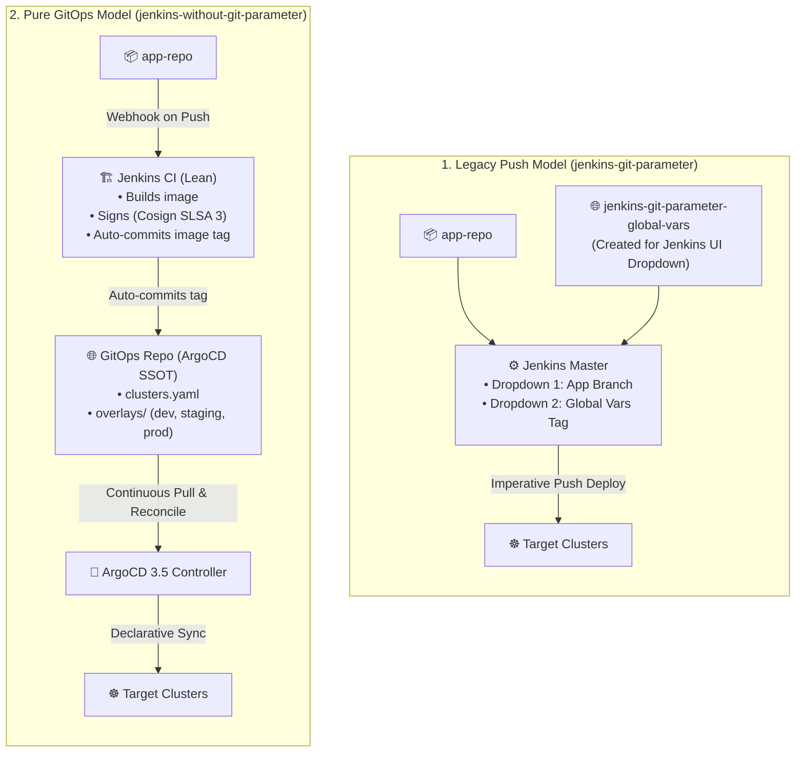
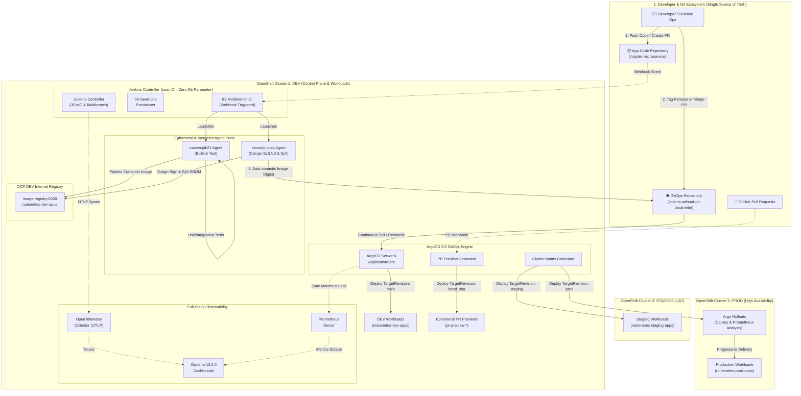
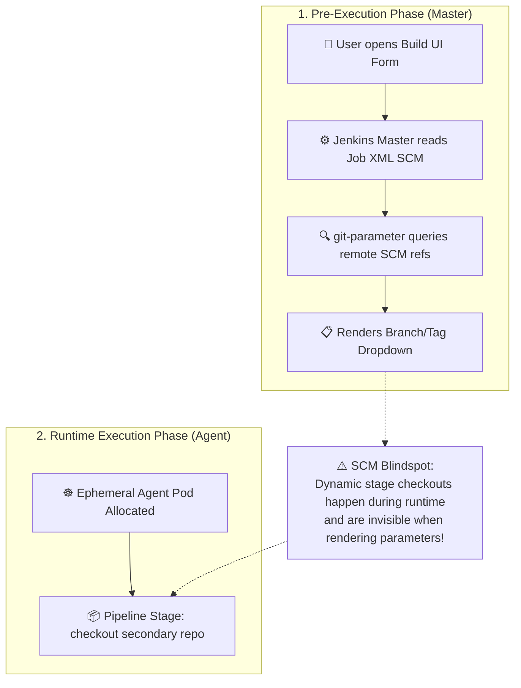
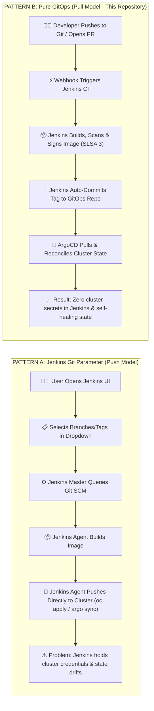
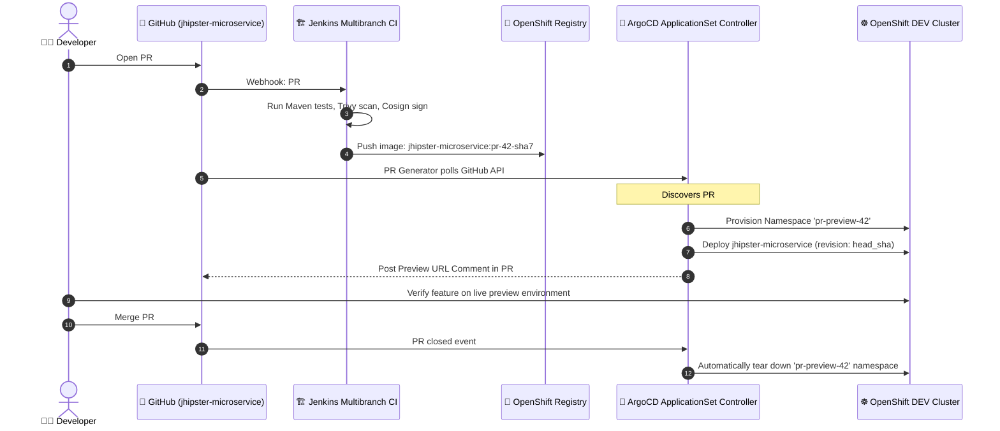
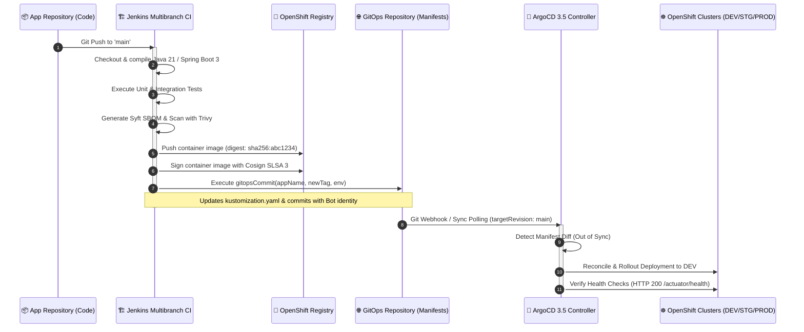
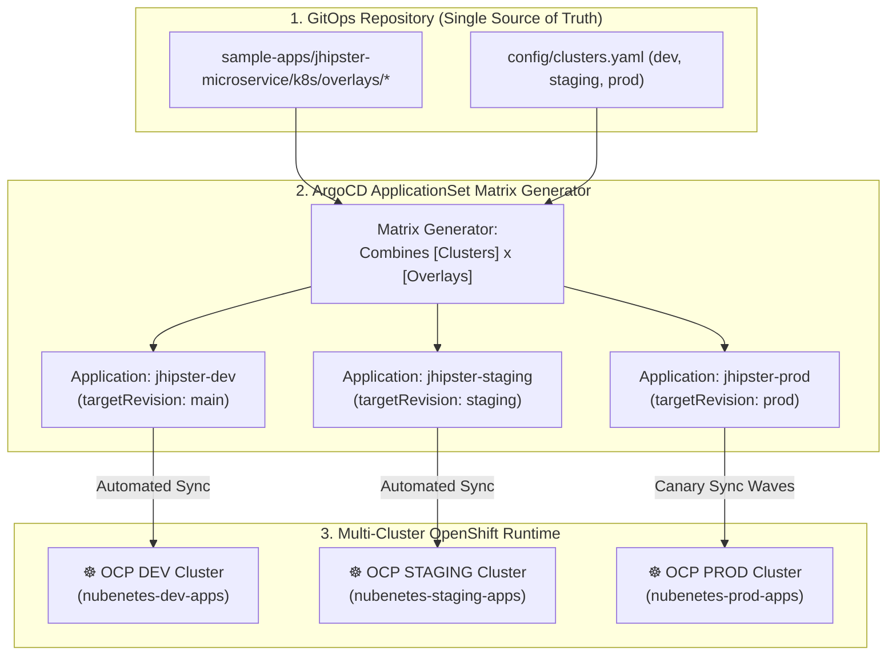
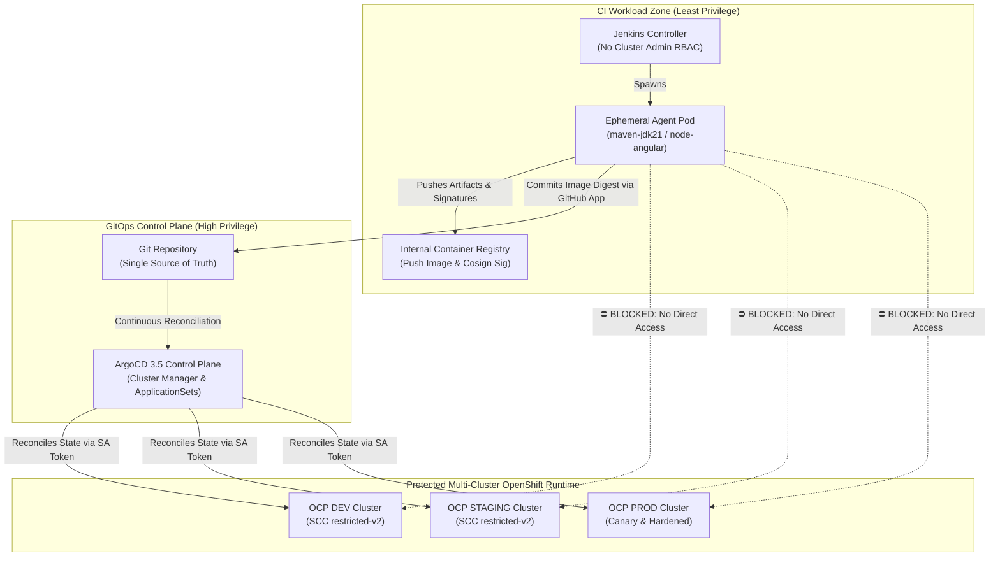
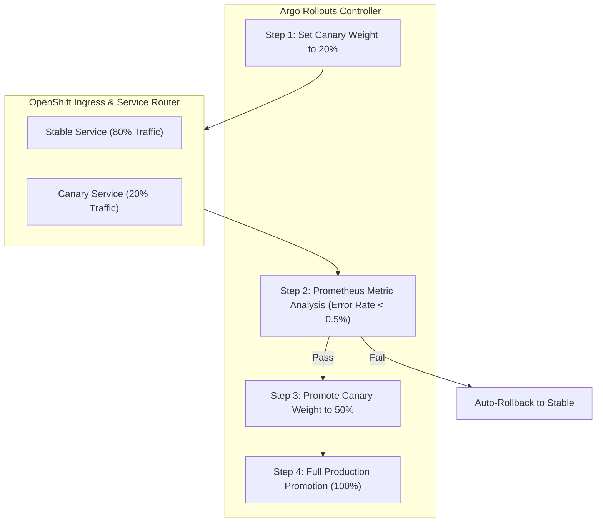
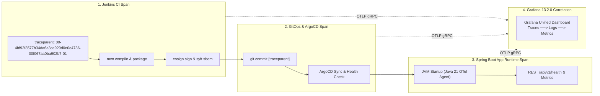

# Jenkins Without Git Parameter & Multi-Cluster GitOps IaC Platform on OpenShift 4.20+

> [!WARNING]
> **AI Generation & Template Disclaimer**
> This repository has been generated by **Gemini 3.7 Flash** and has not been tested nor validated in a real production environment. Its purpose is strictly for the generation of reference architectures, templates, design patterns, and Infrastructure as Code (IaC) blueprints.

<div align="center">

[](https://docs.redhat.com/en/documentation/openshift_container_platform/4.17/)
[](https://kubernetes.io/)
[](https://www.jenkins.io/)
[](https://argo-cd.readthedocs.io/en/stable/)
[](https://helm.sh/)

[](https://opengitops.net/)
[](https://www.jenkins.io/)
[](https://argo-cd.readthedocs.io/en/stable/operator-manual/applicationset/)
[](https://opentelemetry.io/)
[](https://prometheus.io/)
[](https://grafana.com/)
[](https://openjdk.org/projects/jdk/21/)
[](https://docs.sigstore.dev/cosign/overview/)
[](https://trivy.dev/)
[](https://docs.redhat.com/en/documentation/openshift_container_platform/4.17/html/authentication_and_authorization/managing-pod-security-policies)
[](LICENSE)

</div>

> [!IMPORTANT]
> ### 🔗 Architecture Paradigm & Linked Repositories
> This platform implements the **Pure GitOps (Pull-based) Architecture**, serving as the modern cloud-native alternative to the push-based [`nubenetes/jenkins-git-parameter`](https://github.com/nubenetes/jenkins-git-parameter) pattern:
> * 🚀 **Pure GitOps Platform Orchestrator (This Repository)**: [**`nubenetes/jenkins-without-git-parameter`**](https://github.com/nubenetes/jenkins-without-git-parameter) — Infrastructure-as-Code, Lean Jenkins JCasC CI, ArgoCD 3.5 ApplicationSets, Native TargetRevision Selection, and OpenTelemetry Observability.
> * 🌐 **Reference Push-Based Repository**: [**`nubenetes/jenkins-git-parameter`**](https://github.com/nubenetes/jenkins-git-parameter) — Legacy/Push model with Jenkins UI `gitParameter` dropdowns and multi-remote SCM Job DSL.
> * ☕ **Workload Reference Microservice**: [**`nubenetes/jhipster-microservice`**](https://github.com/nubenetes/jhipster-microservice) — Java 21 / Spring Boot 3 cloud-native microservice with OpenTelemetry and Prometheus integration.

---

## 📑 Table of Contents

- [Executive Summary & Architectural Paradigm Shift](#executive-summary--architectural-paradigm-shift)
- [In-Depth Architectural Comparison: Push vs. Pull Model](#in-depth-architectural-comparison-push-vs-pull-model)
  - [1. Comprehensive Comparison Matrix: Jenkins Git Parameter vs. Pure GitOps](#1-comprehensive-comparison-matrix-jenkins-git-parameter-vs-pure-gitops)
  - [2. The Root Cause of Jenkins SCM Friction (Why Git Parameter Fails at Scale)](#2-the-root-cause-of-jenkins-scm-friction-why-git-parameter-fails-at-scale)
  - [3. How Git & ArgoCD Solve Parameterization Natively](#3-how-git--argocd-solve-parameterization-natively)
  - [4. Why There is No 'jenkins-without-git-parameter-global-vars' Repository (Architectural Rationale)](#4-why-there-is-no-jenkins-without-git-parameter-global-vars-repository-architectural-rationale)
- [Comprehensive Mermaid Architecture Diagrams & Workflows](#comprehensive-mermaid-architecture-diagrams--workflows)
  - [1. End-to-End Multi-Cluster Platform Topology](#1-end-to-end-multi-cluster-platform-topology)
  - [2. Jenkins SCM Pre-Execution Lifecycle Blindspot](#2-jenkins-scm-pre-execution-lifecycle-blindspot)
  - [3. Side-by-Side Flow Comparison: Push vs. Pull](#3-side-by-side-flow-comparison-push-vs-pull)
  - [4. Dynamic Ephemeral Pull Request (PR) Preview Environments](#4-dynamic-ephemeral-pull-request-pr-preview-environments)
  - [5. Automated CI -> GitOps Promotion Sequence](#5-automated-ci---gitops-promotion-sequence)
  - [6. ArgoCD Multi-Cluster Matrix Reconciliation Engine](#6-argocd-multi-cluster-matrix-reconciliation-engine)
  - [7. Zero-Trust Security & RBAC Boundary Architecture](#7-zero-trust-security--rbac-boundary-architecture)
  - [8. Progressive Delivery with Argo Rollouts Canary](#8-progressive-delivery-with-argo-rollouts-canary)
  - [9. Full-Stack Observability & Trace Context Propagation](#9-full-stack-observability--trace-context-propagation)
- [Which Pattern is Easier, Recommended, and Why?](#which-pattern-is-easier-recommended-and-why)
  - [1. Operational Simplicity & Maintenance](#1-operational-simplicity--maintenance)
  - [2. Security Posture & Zero-Trust Compliance](#2-security-posture--zero-trust-compliance)
  - [3. Reliability, Rollback & Disaster Recovery](#3-reliability-rollback--disaster-recovery)
  - [4. Developer Ergonomics & Inner/Outer Loop Flow](#4-developer-ergonomics--innerouter-loop-flow)
  - [5. Verdict & Recommendation Summary](#5-verdict--recommendation-summary)
- [Platform Architecture & Component Details](#platform-architecture--component-details)
  - [1. Lean Jenkins Controller (Zero Parameter Plugins)](#1-lean-jenkins-controller-zero-parameter-plugins)
  - [2. ArgoCD 3.5 ApplicationSets & TargetRevision Engine](#2-argocd-35-applicationsets--targetrevision-engine)
  - [3. Supply Chain Security (Cosign SLSA 3, Syft, Trivy)](#3-supply-chain-security-cosign-slsa-3-syft-trivy)
  - [4. Observability with OpenTelemetry, Prometheus & Grafana 13.2.0](#4-observability-with-opentelemetry-prometheus--grafana-1320)
- [Repository Structure](#repository-structure)
- [Quick Start: 1-Click Automated Deployment](#quick-start-1-click-automated-deployment)
  - [Prerequisites](#prerequisites)
  - [1. Deploy the Complete Platform](#1-deploy-the-complete-platform)
  - [2. Verify Platform Endpoints](#2-verify-platform-endpoints)
  - [3. Day-2 GitOps Scenarios & Branch/Tag Selection](#3-day-2-gitops-scenarios--branchtag-selection)
- [Decommissioning & Reinstallation](#decommissioning--reinstallation)
- [References & Evidence Links](#references--evidence-links)

---

## Executive Summary & Architectural Paradigm Shift

In modern cloud-native engineering on **Red Hat OpenShift 4.20+**, organizations face a pivotal architectural choice for continuous delivery:

1. **The Imperative Push Model (`jenkins-git-parameter`)**:
   Jenkins is treated as a monolithic orchestrator. Developers open the Jenkins Web UI, select branches, git tags, or commit SHAs via the `git-parameter` plugin, and Jenkins pushes container images and executes imperative deployment commands (`oc apply`, `helm upgrade`, or `argocd app sync`) directly against target clusters.
2. **The Declarative Pull Model (`jenkins-without-git-parameter` - Pure GitOps)**:
   Jenkins is decoupled and strictly scoped to **Continuous Integration (CI)** (linting, automated testing, container image packaging, Trivy vulnerability scanning, Syft SBOM generation, and Cosign SLSA 3 signing). Jenkins has **zero deployment parameters and zero cluster credentials**. 
   
   **All parameter selections (branches, tags, commits, environment overrides)** are executed natively via **Git (the Single Source of Truth)** and **ArgoCD 3.5**:
   - Branch & commit selection via Git Pull Requests and merge workflows.
   - Release selection via Git Semantic Versioning tags (`v1.2.0`, `release-2026.09`).
   - Dynamic ephemeral preview environments via **ArgoCD ApplicationSets** (PR and Branch Generators).
   - On-demand revision overrides via ArgoCD UI/CLI native `targetRevision` tracking.

This repository provides the complete, production-ready **Infrastructure as Code (IaC)** blueprint, JCasC, Multibranch Pipelines, Helm values, ArgoCD ApplicationSets, and OpenTelemetry observability configurations implementing the **Pure GitOps pattern**.

---

## In-Depth Architectural Comparison: Push vs. Pull Model

### 1. Comprehensive Comparison Matrix: Jenkins Git Parameter vs. Pure GitOps

| Architectural Dimension | `jenkins-git-parameter` (Imperative Push) | `jenkins-without-git-parameter` (Declarative Pull / Pure GitOps) | Advantage & Recommendation |
| :--- | :--- | :--- | :--- |
| **Architectural Paradigm** | **Push**: Jenkins acts as the central master driving both build and cluster state. | **Pull**: Jenkins does CI only; ArgoCD continuously pulls and reconciles cluster state from Git. | 🏆 **GitOps**: Cloud-native standard (CNCF / OpenGitOps). |
| **Where Parameters are Selected** | **Jenkins Web UI**: User selects branch/tag/commit via `git-parameter` dropdowns. | **Git & ArgoCD**: Selected via Git branches, tags, PRs, or ArgoCD `targetRevision` UI/CLI. | 🏆 **GitOps**: Eliminates Jenkins UI lag and human form errors. |
| **Single Source of Truth (SSOT)** | **Split/Ambiguous**: Jenkins build logs and job history hold the state of what was deployed. | **Pure Git**: Git repository commit history is the single, cryptographically auditable source of truth. | 🏆 **GitOps**: Immutable commit logs with GPG/Cosign attestation. |
| **Jenkins Master Performance** | **High Overhead**: Master dynamically queries remote Git refs before rendering build forms; prone to SCM latency. | **Zero Overhead**: Jenkins uses lightweight webhooks and multibranch indexing; zero UI querying overhead. | 🏆 **GitOps**: Controller remains fast, stable, and highly responsive. |
| **Multi-Repository Complexity** | **Complex & Fragile**: Requires multi-remote SCM hacks in Job DSL (`origin-app`, `origin-vars`) to query two repos. | **Decoupled & Native**: Application code and GitOps manifests are cleanly separated; ArgoCD manages multi-repo natively. | 🏆 **GitOps**: Clean separation of concerns (Code vs Config). |
| **Security & Credential Boundary** | **High Exposure**: Jenkins Master and ephemeral agents require cluster admin tokens and ArgoCD API keys. | **Zero-Trust**: Jenkins only has write access to internal container registry & Git repo. Only ArgoCD has cluster access. | 🏆 **GitOps**: Drastically reduced blast radius and attack surface. |
| **Configuration Drift Handling** | **Blindspot**: If someone changes a resource via `oc edit` or `kubectl`, Jenkins cannot detect or fix it until the next build. | **Continuous Self-Healing**: ArgoCD continuously monitors cluster state and automatically self-heals any unauthorized drift. | 🏆 **GitOps**: Zero drift guarantee across all OpenShift clusters. |
| **Rollback Mechanism** | **Imperative Re-run**: Requires finding a prior Jenkins build ID, selecting the old git tag, and running the pipeline. | **Instant Git Revert**: Standard `git revert <commit>` or 1-click rollback in ArgoCD UI/CLI. | 🏆 **GitOps**: Deterministic, instant, and fully traceable. |
| **Ephemeral / Preview Environments** | **Script-Heavy**: Jenkinsfiles must contain complex Groovy stages to `oc create ns`, deploy, and register cleanup hooks. | **Declarative ApplicationSets**: ArgoCD PR Generator automatically creates and destroys preview environments per GitHub PR. | 🏆 **GitOps**: Zero custom Groovy scripts; 100% automated lifecycle. |
| **Multi-Cluster Scalability** | **Difficult**: Jenkins pipelines must iterate through cluster endpoints sequentially with individual credentials. | **Native Matrix Generator**: ArgoCD ApplicationSet Matrix Generator deploys to 100+ clusters via simple cluster label matching. | 🏆 **GitOps**: Infinite horizontal cluster scalability. |
| **Disaster Recovery (DR)** | **Time-Consuming**: Must restore Jenkins database, job histories, and rerun pipelines in order. | **Instantaneous**: Point ArgoCD to the Git repository in a new cluster, and the entire state is re-created in minutes. | 🏆 **GitOps**: Complete disaster recovery in a single `kubectl apply`. |
| **Plugin Maintenance & Vulnerabilities**| **High Maintenance**: Requires `git-parameter`, `active-choices`, `matrix-project`, and SCM plugins that need frequent patching. | **Lean & Resilient**: Zero parameter plugins needed. Jenkins runs with core pipeline and branch source plugins. | 🏆 **GitOps**: Minimal plugin footprint, fewer CVEs, easier upgrades. |

---

### 2. The Root Cause of Jenkins SCM Friction (Why Git Parameter Fails at Scale)

In the `jenkins-git-parameter` pattern, engineering teams hit three major architectural bottlenecks:

1. **The Pre-Execution vs. Runtime Lifecycle Paradox**:
   Jenkins renders build parameter dropdowns in the browser **before** launching an agent pod, before cloning source code, and before running pipeline stages. Therefore, `git-parameter` can only query Git repositories statically defined in the Jenkins Master's Job XML configuration.
2. **The SCM Multi-Remote Binding Bottleneck**:
   Declarative Pipelines (`cpsScm`) were designed for a single primary SCM. When a pipeline needs to select a branch from an application repository (`app-repo`) AND a configuration tag from an environment repository (`global-vars`), Job DSL must configure multi-remote Git refspecs (`origin-app`, `origin-vars`), making jobs brittle and complex.
3. **Security Inversion**:
   In push-based Jenkins, Jenkins agents must possess broad OpenShift cluster administrative privileges or ArgoCD admin tokens to deploy resources, violating the principle of least privilege.

---

### 3. How Git & ArgoCD Solve Parameterization Natively

By transitioning to the **Pure GitOps pattern (`jenkins-without-git-parameter`)**, parameterization is decoupled from the CI server and moved to native Git and ArgoCD primitives:

```
┌──────────────────────────────────────────────────────────────────────────────────────────┐
│                             Pure GitOps Parameter Selection                              │
├──────────────────────────────────────┬───────────────────────────────────────────────────┤
│ Requirement                          │ How it is Handled in Pure GitOps                  │
├──────────────────────────────────────┼───────────────────────────────────────────────────┤
│ 1. Deploying a Feature Branch        │ Open a Pull Request in GitHub ──>                 │
│                                      │ ArgoCD ApplicationSet PR Generator creates        │
│                                      │ preview-pr-<number> environment automatically.    │
├──────────────────────────────────────┼───────────────────────────────────────────────────┤
│ 2. Deploying a Release Tag (v1.2.0)  │ Create a Git Release Tag `v1.2.0` in GitOps repo  │
│                                      │ (or update targetRevision in ArgoCD Application). │
├──────────────────────────────────────┼───────────────────────────────────────────────────┤
│ 3. Ad-hoc Commit / Hotfix Override   │ Execute `argocd app set <app> --revision <sha>`   │
│                                      │ or select revision in the ArgoCD Web UI dialog.   │
├──────────────────────────────────────┼───────────────────────────────────────────────────┤
│ 4. Promoting DEV -> STAGING -> PROD  │ Jenkins CI automatically commits image tag to Git │
│                                      │ or opens a Promotion PR across environment files. │
└──────────────────────────────────────┴───────────────────────────────────────────────────┘
```

---

### 4. Why There is No `jenkins-without-git-parameter-global-vars` Repository (Architectural Rationale)

A frequent question when transitioning from the legacy `jenkins-git-parameter` pattern to pure GitOps is: **"Why is there no `jenkins-without-git-parameter-global-vars` repository?"**

<details>
<summary>🌐 <b>Click to expand: Legacy Global-Vars vs. Pure GitOps Repository Topology Diagram</b></summary>
<br/>



</details>

#### The 4 Core Architectural Reasons Why `*-global-vars` is Obsolete

1. **Jenkins No Longer Has UI Dropdowns for Deployment**:
   * In `jenkins-git-parameter`, the user opened the Jenkins Web UI form and selected two dropdown parameters: `APP_REVISION` (microservice branch) and `GLOBAL_VARS_REVISION` (environment config branch/tag).
   * In `jenkins-without-git-parameter`, Jenkins CI runs 100% automated via webhooks. It builds and tests the commit, pushes the container image, and writes the new image tag to Git. **There is no human in Jenkins selecting a configuration version**, so Jenkins has no need for a dedicated configuration dropdown repo.
2. **Configuration Belongs to ArgoCD (GitOps), Not to Jenkins**:
   * In pure GitOps, environment definitions, cluster inventories, and Helm/Kustomize values belong to the **GitOps Control Plane (ArgoCD)**.
   * Naming a configuration repository `jenkins-*-global-vars` is an anti-pattern in modern cloud-native architectures because **Jenkins does not own the cluster state—ArgoCD and Git own it**.
3. **Elimination of the SCM Multi-Remote Workaround**:
   * In Jenkins, querying two git repositories in a single declarative pipeline required complex Job DSL refspec workarounds (`origin-app`, `origin-vars`).
   * In Pure GitOps, this problem completely vanishes. Application source code and deployment manifests are decoupled by design.
4. **Self-Contained GitOps Structure**:
   * All cluster definitions (`config/clusters.yaml`), environment overlays (`sample-apps/gitops-manifests/environments/`), and application definitions (`argocd-apps/`) are cleanly organized within standard GitOps structures without requiring Jenkins-specific bindings.

#### ⚖️ Legacy `global-vars` vs. Pure GitOps Manifests

| Feature | Legacy `jenkins-git-parameter-global-vars` | GitOps Manifests (`jenkins-without-git-parameter`) |
| :--- | :--- | :--- |
| **Primary Consumer** | **Jenkins Master** (queries refs for UI dropdown). | **ArgoCD 3.5** (reconciles cluster state continuously). |
| **Parameter Mechanism** | Jenkins `gitParameter` plugin & Active Choices. | Git branches, release tags (`v1.2.0`), or PRs. |
| **Who Modifies It?** | Developers manually via Jenkins UI inputs. | **Automated Bot**: Jenkins CI auto-commits image tags on merge. |
| **Drift Detection** | None (Jenkins cannot detect cluster drift). | **Continuous**: ArgoCD self-heals any divergence from Git. |
| **Repo Maintenance** | High (must synchronize Jenkins credentials & SCM). | Low (Standard Git repository tracked by ArgoCD). |

#### 🏢 GitOps Repository Topology Options in Production

If your organization prefers separating the platform IaC from workload manifests, there are two standard topologies:

1. **Platform Monorepo (Current Repository)**:
   * Everything (Helm charts, JCasC, ArgoCD ApplicationSets, and sample GitOps manifests) lives in [`jenkins-without-git-parameter`](https://github.com/nubenetes/jenkins-without-git-parameter).
   * **Best for**: 1-click deployment, self-contained demos, and small-to-medium platforms.
2. **Enterprise Multi-Repo (Polyrepo GitOps)**:
   * `app-repo` (e.g., `jhipster-microservice`): Developer source code + Dockerfile.
   * `ci-platform-repo` (`jenkins-without-git-parameter`): Jenkins JCasC, Helm values, and Job DSL.
   * `gitops-manifests-repo` (e.g., `nubenetes/gitops-manifests`): Pure Kubernetes/ArgoCD environment overlays (`dev`, `staging`, `prod`).
   * Notice that even in a polyrepo setup, the repository is named **`gitops-manifests`**, never `jenkins-global-vars`, because it is managed by **ArgoCD**, not Jenkins.

---

## Comprehensive Mermaid Architecture Diagrams & Workflows

### 1. End-to-End Multi-Cluster Platform Topology

<details>
<summary>🗺️ <b>Click to expand: End-to-End Multi-Cluster Platform Topology Diagram</b></summary>
<br/>



</details>

---

### 2. Jenkins SCM Pre-Execution Lifecycle Blindspot

<details>
<summary>⚠️ <b>Click to expand: Jenkins SCM Pre-Execution Lifecycle Blindspot Diagram</b></summary>
<br/>



</details>

---

### 3. Side-by-Side Flow Comparison: Push vs. Pull

<details>
<summary>🔄 <b>Click to expand: Side-by-Side Architectural Flow (Push vs. Pull)</b></summary>
<br/>



</details>

---

### 4. Dynamic Ephemeral Pull Request (PR) Preview Environments

<details>
<summary>⚡ <b>Click to expand: Dynamic Ephemeral PR Preview Environments Sequence Diagram</b></summary>
<br/>



</details>

---

### 5. Automated CI -> GitOps Promotion Sequence

<details>
<summary>🚀 <b>Click to expand: Automated CI -> GitOps Promotion Sequence Diagram</b></summary>
<br/>



</details>

---

### 6. ArgoCD Multi-Cluster Matrix Reconciliation Engine

<details>
<summary>⚙️ <b>Click to expand: ArgoCD Multi-Cluster Matrix Reconciliation Engine Diagram</b></summary>
<br/>



</details>

---

### 7. Zero-Trust Security & RBAC Boundary Architecture

<details>
<summary>🛡️ <b>Click to expand: Zero-Trust Security & RBAC Boundary Architecture Diagram</b></summary>
<br/>



</details>

---

### 8. Progressive Delivery with Argo Rollouts Canary

<details>
<summary>📊 <b>Click to expand: Progressive Delivery & Prometheus Metric Analysis Diagram</b></summary>
<br/>



</details>

---

### 9. Full-Stack Observability & Trace Context Propagation

<details>
<summary>🔭 <b>Click to expand: Full-Stack Observability & W3C Trace Context Propagation Diagram</b></summary>
<br/>



</details>

---

## Which Pattern is Easier, Recommended, and Why?

### 1. Operational Simplicity & Maintenance

* **`jenkins-git-parameter`**:
  Requires managing legacy Jenkins plugins (`git-parameter`, `active-choices`, `job-dsl` multi-remote SCM hacks). As the number of microservices grows to dozens or hundreds, maintaining Jenkins Job XML definitions and handling SCM caching issues becomes an operational nightmare.
* **`jenkins-without-git-parameter` (Pure GitOps)**:
  Jenkins requires **zero custom parameter plugins**. It operates as a standard multibranch CI engine triggered by git events. The developer interface is Git itself (pull requests, release tags), which all developers already know. **Pure GitOps is far easier to operate, automate, and scale.**

### 2. Security Posture & Zero-Trust Compliance

* **`jenkins-git-parameter`**:
  Jenkins agents must be given direct deployment credentials (Kubernetes service account tokens with create/update rights, ArgoCD admin tokens). A compromised Jenkins build script can compromise the entire OpenShift cluster.
* **`jenkins-without-git-parameter` (Pure GitOps)**:
  Jenkins agents only have write access to the container registry and Git repository. **Jenkins has zero cluster credentials.** Even if a build container is compromised, the attacker cannot modify the production cluster.

### 3. Reliability, Rollback & Disaster Recovery

* **`jenkins-git-parameter`**:
  Deployments are imperative events. If a cluster goes down, re-creating the exact state of all applications requires identifying and re-running specific historical Jenkins builds. Configuration drift is invisible to Jenkins.
* **`jenkins-without-git-parameter` (Pure GitOps)**:
  Git holds the complete, declarative desired state. If a cluster is destroyed, pointing ArgoCD at the GitOps repository restores 100% of all microservices, configs, routes, and policies in minutes. Rollback is as simple as `git revert`.

### 4. Developer Ergonomics & Inner/Outer Loop Flow

* **`jenkins-git-parameter`**:
  Forces developers to leave their IDE and Git workflow, navigate to Jenkins UI, wait for dropdowns to populate from remote Git, fill out forms, and trigger builds manually.
* **`jenkins-without-git-parameter` (Pure GitOps)**:
  Developers remain entirely in Git. Opening a PR automatically triggers CI tests and spins up an ephemeral preview environment via ArgoCD ApplicationSets. Merging to `main` deploys to DEV. Tagging `v1.0.0` deploys to PROD.

### 5. Verdict & Recommendation Summary

> [!TIP]
> ### 🏆 Final Recommendation: Pure GitOps (`jenkins-without-git-parameter`)
> **The Pure GitOps pattern is strongly recommended for all enterprise cloud-native workloads.**
> 
> * **Easier to Maintain**: No Jenkins SCM multi-remote hacks, no parameter plugin bugs, no pre-execution lifecycle bottlenecks.
> * **Significantly More Secure**: Zero-trust architecture where CI has no cluster deployment tokens.
> * **Standardized & Future-Proof**: Aligned with CNCF, OpenGitOps, and Red Hat OpenShift reference architectures.

---

## Platform Architecture & Component Details

### 1. Lean Jenkins Controller (Zero Parameter Plugins)

The Jenkins Controller is deployed using the official Jenkins Helm chart configured via **Jenkins Configuration as Code (JCasC)**.

* **Plugins (`helm/jenkins/plugins.txt`)**: Contains strictly core multibranch, kubernetes, opentelemetry, and security plugins. `git-parameter` is completely excluded.
* **JCasC (`jcasc/jenkins-jcasc.yaml`)**: Provisions security matrix, OpenTelemetry exporter endpoints, and seed job automation.
* **Job DSL (`jobdsl/pipelines-ci.groovy`)**: Declares `multibranchPipelineJob` instances that automatically scan branches and pull requests.
* **Ephemeral Agents (`jcasc/pod-templates.yaml`)**: Kubernetes pod templates for `maven-jdk21`, `node-angular`, `security-tools`, and `gitops-bot` complying with OpenShift `restricted-v2` SCC.

---

### 2. ArgoCD 3.5 ApplicationSets & TargetRevision Engine

ArgoCD 3.5 serves as the single source of truth for continuous deployment across clusters:

* **Root App-of-Apps (`argocd-apps/root-app-of-apps.yaml`)**: Bootstraps all platform applications declaratively.
* **Cluster Matrix Generator (`argocd-apps/applicationset-clusters.yaml`)**: Uses ApplicationSet Matrix Generators to deploy workloads across all registered OpenShift clusters (`DEV`, `STAGING`, `PROD`).
* **PR Preview Generator (`argocd-apps/applicationset-pull-request-preview.yaml`)**: Dynamically creates and destroys preview environments per GitHub PR.
* **TargetRevision Management**:
  * DEV: `targetRevision: main` (Continuous deployment on merge).
  * STAGING: `targetRevision: staging` (or semver release tags).
  * PROD: `targetRevision: prod` (Protected release branch with Argo Rollouts Canary).

---

### 3. Supply Chain Security (Cosign SLSA 3, Syft, Trivy)

The CI pipeline implements end-to-end software supply chain security:

1. **Vulnerability Scanning**: Aqua Security Trivy scans all application binaries and container base layers.
2. **SBOM Generation**: Anchore Syft generates CycloneDX Software Bill of Materials.
3. **Container Signing & Attestation**: Sigstore Cosign signs the container image digest and attaches the SBOM attestation.
4. **OpenShift Image Signature Policy (`security/openshift-image-signature-policy.yaml`)**: Enforces that only Cosign-signed images can run in production.

---

### 4. Observability with OpenTelemetry, Prometheus & Grafana 13.2.0

* **OpenTelemetry Plugin**: Emits W3C distributed trace spans (`traceparent`) from Jenkins CI stages to the OpenTelemetry Collector.
* **ArgoCD Metrics**: Exported directly to Prometheus for sync duration, health status, and drift alerts.
* **Grafana 13.2.0 Dashboards (`observability/dashboards/`)**:
  * `argocd-gitops-sync.json`: Real-time GitOps synchronization and cluster drift monitoring.
  * `jenkins-performance-otel.json`: CI build duration, queue latency, and pipeline execution traces.
  * `app-full-stack-correlation.json`: End-to-end correlation from Git commit -> Jenkins CI build -> ArgoCD sync -> Spring Boot microservice runtime.

---

## Repository Structure

```text
.
├── .gitignore
├── LICENSE
├── Makefile                                    # Automation CLI (deploy, destroy, reinstall, promote)
├── README.md                                   # Master architectural blueprint & documentation
├── deploy.sh                                   # 1-Click platform deployment script
├── destroy.sh                                  # Clean teardown script
├── reinstall.sh                                # Full wipe and fresh redeployment
├── config/
│   ├── clusters.yaml                           # Multi-cluster topologies (DEV, STG, PRD)
│   └── environments.env                        # Environment variables & platform domain endpoints
├── argocd-apps/
│   ├── root-app-of-apps.yaml                   # ArgoCD Root App-of-Apps bootstrapper
│   ├── applicationset-clusters.yaml            # Multi-cluster matrix generator
│   ├── applicationset-pull-request-preview.yaml# Dynamic PR preview environment generator
│   ├── applicationset-git-branches.yaml        # Git branch/tag tracking generator
│   └── apps/
│       ├── dev/
│       │   ├── jhipster-microservice.yaml      # DEV Application (targetRevision: main)
│       │   └── grafana-observability.yaml      # Observability stack application
│       ├── staging/
│       │   └── jhipster-microservice.yaml      # STAGING Application (targetRevision: staging)
│       └── prod/
│           └── jhipster-microservice.yaml      # PROD Application (targetRevision: prod / Canary)
├── helm/
│   ├── jenkins/
│   │   ├── Chart.yaml
│   │   ├── values.yaml                         # Standard Jenkins Helm values
│   │   ├── values-openshift.yaml               # OpenShift 4.20+ hardened values (restricted-v2)
│   │   └── plugins.txt                         # Lean plugins (NO git-parameter plugin)
│   ├── argocd/
│   │   └── values-argocd-3.5.yaml              # ArgoCD 3.5 Helm values with ApplicationSets
│   └── observability/
│       ├── grafana-values.yaml                 # Grafana 13.2.0 with OTel & Prometheus datasources
│       ├── prometheus-values.yaml              # Prometheus metrics configuration
│       └── otel-collector-values.yaml          # OpenTelemetry OTLP Collector configuration
├── jcasc/
│   ├── jenkins-jcasc.yaml                      # JCasC Master configuration
│   ├── pod-templates.yaml                      # Kubernetes agent pod templates
│   └── github-app-credentials.yaml             # GitHub App credentials for SCM & GitOps PRs
├── jenkinsfiles/
│   └── ci/
│       ├── Jenkinsfile.app-java-maven          # Pure CI: Test, build, Trivy, Syft, Cosign, GitOps commit
│       └── Jenkinsfile.app-angular             # Pure CI for Angular frontend
├── jobdsl/
│   ├── seed-job.groovy                         # Master seed job folder provisioner
│   └── pipelines-ci.groovy                     # Multibranch Pipeline Job DSL (Zero parameters)
├── observability/
│   └── dashboards/
│       ├── argocd-gitops-sync.json             # ArgoCD GitOps sync dashboard
│       ├── jenkins-performance-otel.json       # Jenkins pipeline traces & metrics dashboard
│       └── app-full-stack-correlation.json     # End-to-end trace correlation dashboard
├── sample-apps/
│   ├── jhipster-microservice/                  # Java 21 / Spring Boot 3 cloud-native microservice
│   │   ├── Dockerfile
│   │   ├── pom.xml
│   │   ├── k8s/                                # Base & overlays for dev, staging, prod
│   │   ├── rollout/                            # Argo Rollouts Canary & AnalysisTemplate
│   │   └── src/...
│   └── gitops-manifests/                       # Dedicated GitOps configuration repository
│       ├── apps/applications-inventory.yaml
│       ├── clusters/
│       └── environments/
├── scripts/
│   ├── deploy.sh
│   ├── destroy.sh
│   ├── generate-tokens.sh
│   ├── gitops-promote.sh                       # CLI helper for GitOps release promotion
│   ├── ocp-setup-scc.sh                        # OpenShift SCC restricted-v2 configuration
│   └── setup-argocd-clusters.sh                # Multi-cluster ArgoCD secret registration
├── security/
│   ├── openshift-image-signature-policy.yaml   # Cosign image signature verification policy
│   └── external-secrets-operator/              # Vault / ESO zero-trust secrets integration
└── shared-library/
    ├── src/com/nubenetes/gitops/
    └── vars/
        ├── cosignSign.groovy                   # Cosign container signing step
        ├── sbomGenerate.groovy                 # Syft SBOM generation step
        ├── gitopsCommit.groovy                 # Automated GitOps commit / PR step
        ├── otelLogEvent.groovy                 # OTel span event logger
        └── skopeoPromote.groovy                # Skopeo container image promotion step
```

---

## Quick Start: 1-Click Automated Deployment

### Prerequisites

* Red Hat OpenShift Container Platform (OCP) 4.20+ or Kubernetes 1.31+ cluster.
* `oc` or `kubectl` CLI logged in with `cluster-admin` permissions.
* `helm` v3.14+ installed.

### 1. Deploy the Complete Platform

Clone the repository and run the automated deployment script:

```bash
git clone https://github.com/nubenetes/jenkins-without-git-parameter.git
cd jenkins-without-git-parameter

# Deploy the entire platform (Jenkins, ArgoCD 3.5, ApplicationSets, Observability)
./deploy.sh
# or
make deploy
```

### 2. Verify Platform Endpoints

Once deployed, access the web consoles via your OpenShift router domain:

* **Jenkins CI Controller**: `https://jenkins-jenkins.apps.ocp-dev.nubenetes.internal`
* **ArgoCD 3.5 Control Plane**: `https://argocd-server.apps.ocp-dev.nubenetes.internal`
* **Grafana 13.2.0 Dashboards**: `https://grafana.apps.ocp-dev.nubenetes.internal`

---

### 3. Day-2 GitOps Scenarios & Branch/Tag Selection

#### Scenario A: Developer Pushes Feature Branch / PR (Ephemeral Preview)
1. Developer creates branch `feature/auth-redesign` and opens a PR in GitHub.
2. Jenkins Multibranch CI automatically compiles, tests, and signs the image.
3. ArgoCD ApplicationSet PR Generator automatically provisions namespace `pr-preview-<number>` on OpenShift.
4. When the PR is merged, the preview environment is automatically destroyed.

#### Scenario B: Automated DEV Deployment on Merge
1. Merging PR to `main` branch triggers Jenkins CI.
2. CI builds `jhipster-microservice:dev-<sha7>` and updates `sample-apps/gitops-manifests/environments/dev.yaml`.
3. ArgoCD detects the Git commit and reconciles `jhipster-microservice-dev` on `ocp-dev`.

#### Scenario C: Promoting Release to STAGING & PROD
Use the GitOps promotion helper script to update the desired environment:

```bash
# Promote release to STAGING
./scripts/gitops-promote.sh jhipster-microservice staging v1.2.0

# Promote release to PROD (Triggers Argo Rollouts Canary)
./scripts/gitops-promote.sh jhipster-microservice prod v1.2.0
```

Commit and push the change to Git. ArgoCD immediately detects the change and synchronizes the target cluster with zero Jenkins manual intervention!

---

## Decommissioning & Reinstallation

### Clean Decommission

To tear down all deployed workloads, namespaces, and Helm releases:

```bash
./destroy.sh
# or
make destroy
```

### Full Reinstallation

To execute a complete clean wipe and fresh redeployment:

```bash
./reinstall.sh
# or
make reinstall
```

---

## References & Evidence Links

1. **GitOps & Cloud-Native Standards**:
   * OpenGitOps Principles & Standards: https://opengitops.net/
   * CNCF GitOps Working Group: https://github.com/open-gitops/documents
2. **ArgoCD & ApplicationSets**:
   * ArgoCD 3.5 Official Documentation: https://argo-cd.readthedocs.io/en/stable/
   * ArgoCD ApplicationSet Generators (PR & Matrix): https://argo-cd.readthedocs.io/en/stable/operator-manual/applicationset/Generators-List/
   * Argo Rollouts Progressive Delivery & Canary Analysis: https://argoproj.github.io/argo-rollouts/
3. **Jenkins Core & Multibranch Pipelines**:
   * Jenkins Configuration as Code (JCasC): https://www.jenkins.io/projects/jcasc/
   * Jenkins Multibranch Pipeline Specification: https://www.jenkins.io/doc/book/pipeline/multibranch/
   * Jenkins GitHub Branch Source Plugin: https://plugins.jenkins.io/github-branch-source/
4. **Supply Chain Security & Attestation (SLSA Level 3)**:
   * Sigstore Cosign Container Signing: https://docs.sigstore.dev/cosign/overview/
   * SLSA (Supply-chain Levels for Software Artifacts) Specification: https://slsa.dev/
   * Anchore Syft SBOM Generator: https://github.com/anchore/syft
   * Aqua Security Trivy Vulnerability Scanner: https://trivy.dev/
5. **Red Hat OpenShift 4.20+ Hardening**:
   * OpenShift Container Platform Security & SCCs: https://docs.redhat.com/en/documentation/openshift_container_platform/4.17/html/authentication_and_authorization/managing-pod-security-policies
   * OpenShift Image Signature Enforcement: https://docs.redhat.com/en/documentation/openshift_container_platform/4.17/html/images/image-signatures
6. **Full-Stack Observability**:
   * OpenTelemetry (OTel) Project: https://opentelemetry.io/
   * Grafana 13.2.0 Dashboards & Traces: https://grafana.com/docs/grafana/latest/
   * Prometheus Monitoring System: https://prometheus.io/
