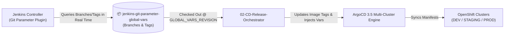

# Centralized Global Configuration & Environment Variables Repository

> [!WARNING]
> **AI Generation & Template Disclaimer**
> This repository has been generated by **Gemini 3.7 Flash** and has not been tested nor validated in a real production environment. Its purpose is strictly for the generation of reference architectures, templates, design patterns, and Infrastructure as Code (IaC) blueprints.

<div align="center">

[](https://github.com/nubenetes/jenkins-git-parameter)
[](https://docs.redhat.com/en/documentation/openshift_container_platform/4.17/)
[](https://argo-cd.readthedocs.io/en/stable/)
[](https://www.gitops.tech/)

</div>

> [!IMPORTANT]
> ### 🔗 Linked Platform & CI/CD Orchestrator
> This repository serves as the centralized GitOps configuration SSOT and is paired with:
> * 🚀 **Main CI/CD Platform Orchestrator**: [**`nubenetes/jenkins-git-parameter`**](https://github.com/nubenetes/jenkins-git-parameter) — OpenShift 4.20+, JCasC, Job DSL, Jenkinsfiles, OpenTelemetry, Grafana 13.2.0, and ArgoCD 3.5.
> * 📄 **Platform Bootstrap Configuration**: [`config/environments.env`](https://github.com/nubenetes/jenkins-git-parameter/blob/main/config/environments.env)
> * ☕ **Workload Reference Microservice**: [**`nubenetes/jhipster-microservice`**](https://github.com/nubenetes/jhipster-microservice)

---

## Overview

This repository (**`jenkins-git-parameter-global-vars`**) serves as the **Single Source of Truth (SSOT)** for environment configurations, multi-cluster topology, Helm values, and version matrices consumed by the **[jenkins-git-parameter](https://github.com/nubenetes/jenkins-git-parameter)** platform on **Red Hat OpenShift 4.20+**.

<details>
<summary>🌐 <b>Click to expand: Global Configuration & GitOps Synchronization Architecture Diagram</b></summary>
<br/>



</details>

---

## Repository Structure

```
jenkins-git-parameter-global-vars/
├── README.md                            # Documentation & usage patterns
├── environments/                        # Environment-specific configuration overlays
│   ├── dev.yaml                         # DEV configuration & application image versions
│   ├── staging.yaml                     # STAGING / UAT configuration
│   └── prod.yaml                        # PRODUCTION high-availability configuration
├── clusters/                            # OpenShift Cluster Topology Definitions
│   ├── ocp-dev-cluster.yaml             # Primary OCP DEV cluster
│   ├── ocp-staging-cluster.yaml         # OCP STAGING cluster
│   └── ocp-prod-cluster.yaml            # OCP PRODUCTION cluster
├── apps/                                # Application metadata & inventory
│   ├── applications-inventory.yaml      # Master inventory of platform services
│   ├── jhipster-microservice.yaml       # Backend Java 21 Spring Boot config
│   └── angular-frontend.yaml            # Frontend Angular 18 config
├── helm-values/                         # Centralized Helm value files
│   ├── jhipster-microservice/
│   │   ├── values-dev.yaml
│   │   ├── values-staging.yaml
│   │   └── values-prod.yaml
│   └── angular-frontend/
│       ├── values-dev.yaml
│       ├── values-staging.yaml
│       └── values-prod.yaml
└── secrets-templates/                   # Sanitized credential templates
    └── database-credentials.env
```

---

## How It Integrates with `jenkins-git-parameter`

1. **Dynamic Parameter Resolution**: The Jenkins pipeline `02-CD-Release-Orchestrators/multi-cluster-release-orchestrator` uses the `git-parameter` plugin pointing directly to this repository (`https://github.com/nubenetes/jenkins-git-parameter-global-vars.git`).
2. **Interactive Selection**: When operators trigger releases in Jenkins, they can dynamically select any Git branch (e.g. `main`, `feature/database-v2`, `env/staging-override`) or Git release tag (e.g. `v2.1.0-release`, `v2.0.8-prod`).
3. **Automated Promotion**: Jenkins pulls the selected version, updates the target environment YAML / Helm values, and syncs ArgoCD 3.5 across the target OpenShift cluster.

---

## Branching & Tagging Strategy

| Branch / Tag Pattern | Purpose | Target Environment |
| :--- | :--- | :--- |
| `main` | Production-ready baseline | DEV / STAGING / PROD |
| `env/staging-override` | Temporary UAT parameter overrides | STAGING |
| `feature/*` | Experimental environment configurations | DEV |
| `v*.*.*-release` | Immutable signed production releases | PROD |
| `hotfix-*` | Fast-track emergency configurations | PROD |

---

## Related Repositories

- 🚀 **Main Orchestration Platform**: [nubenetes/jenkins-git-parameter](https://github.com/nubenetes/jenkins-git-parameter)
- ☕ **Backend Microservice PoC**: [nubenetes/jhipster-microservice](https://github.com/nubenetes/jhipster-microservice)
