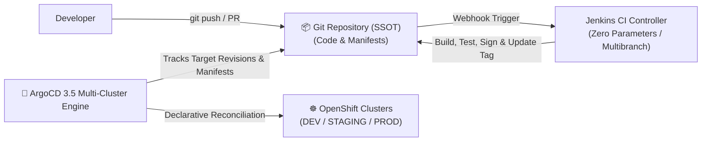

# Centralized Global Configuration & GitOps Environment Manifests

> [!WARNING]
> **AI Generation & Template Disclaimer**
> This repository has been updated and reviewed by **Gemini 3.8 Flash**. Its purpose is strictly for reference architectures, templates, design patterns, and Infrastructure as Code (IaC) blueprints.

<div align="center">

[](https://github.com/nubenetes/jenkins-without-git-parameter)
[](https://docs.redhat.com/en/documentation/openshift_container_platform/4.17/)
[](https://argo-cd.readthedocs.io/en/stable/)
[](https://www.gitops.tech/)

</div>

> [!IMPORTANT]
> ### 🔗 Pure GitOps Architecture
> This directory serves as the centralized GitOps configuration **Single Source of Truth (SSOT)**:
> * 🚀 **Main CI/CD Platform Orchestrator**: [**`nubenetes/jenkins-without-git-parameter`**](https://github.com/nubenetes/jenkins-without-git-parameter) — OpenShift 4.20+, JCasC, Job DSL, Jenkinsfiles, OpenTelemetry, Grafana 13.2.0, and ArgoCD 3.5.
> * 📄 **Platform Bootstrap Configuration**: [`config/environments.env`](file:///home/inaki/github/jenkins-without-git-parameter/config/environments.env)
> * ☕ **Workload Reference Microservice**: [**`sample-apps/jhipster-microservice`**](file:///home/inaki/github/jenkins-without-git-parameter/sample-apps/jhipster-microservice)

---

## Overview

This directory acts as the **Single Source of Truth (SSOT)** for environment configurations, multi-cluster topology, and version matrices consumed by **ArgoCD 3.5** on **Red Hat OpenShift 4.20+**.

Under the **Pure GitOps** paradigm, Jenkins performs continuous integration (compile, test, scan, sign, and commit image tags), while **ArgoCD natively reconciles cluster state directly from Git**, eliminating any need for Jenkins UI parameter dropdowns (`git-parameter`).

<details>
<summary>🌐 <b>Click to expand: Pure GitOps Synchronization Architecture Diagram</b></summary>
<br/>



</details>

---

## Directory Structure

```
sample-apps/gitops-manifests/
├── README.md                            # Documentation & usage patterns
├── environments/                        # Environment-specific configuration overlays
│   ├── dev.yaml                         # DEV configuration & application image versions
│   ├── staging.yaml                     # STAGING / UAT configuration
│   └── prod.yaml                        # PRODUCTION high-availability configuration
├── clusters/                            # OpenShift Cluster Topology Definitions
│   ├── ocp-dev-cluster.yaml             # Primary OCP DEV cluster
│   ├── ocp-staging-cluster.yaml         # OCP STAGING cluster
│   └── ocp-prod-cluster.yaml            # OCP PRODUCTION cluster
└── apps/                                # Application metadata & inventory
    └── applications-inventory.yaml      # Master inventory of platform services
```

---

## How It Integrates with `jenkins-without-git-parameter`

1. **Automated CI GitOps Commit**: The Jenkins CI pipeline (`01-CI-Build-Pipelines`) uses `gitopsCommit` to update target environment manifests (`environments/dev.yaml` or Kustomize overlays) with the newly built and Cosign-signed container image tag.
2. **Declarative ArgoCD Tracking**: ArgoCD ApplicationSets (`multicluster-workloads` and `ephemeral-pr-preview-environments`) continuously monitor Git revisions and deploy updates automatically.
3. **Auditability & Zero Human Error**: Every deployment is backed by an immutable Git commit SHA. No manual Jenkins parameter choices or configuration drift.

---

## Environment & Promotion Strategy

| Environment | Tracking Branch / Revision | ArgoCD Strategy | Purpose |
| :--- | :--- | :--- | :--- |
| `dev` | `main` | Automated sync & prune | Continuous deployment upon PR merge |
| `staging` | `staging` (or release tags) | Automated sync with health gates | Pre-production validation and UAT |
| `prod` | `prod` (protected release tags) | Argo Rollouts (Canary / Analysis) | Production traffic with automated metric gates |
